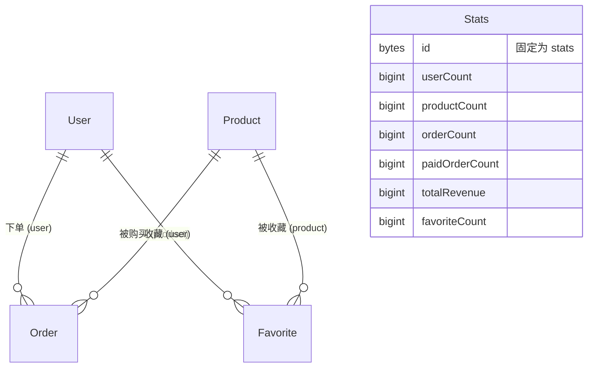

# GraphQL 查询学习教程（基于本项目的 Subgraph 数据模型）

> 本教程带你从零学习使用 GraphQL 查询 The Graph Subgraph 中的数据。
> **所有查询示例均基于本项目 `zh-subgraph-01/schema.graphql` 中定义的实体**：
> `User`（用户）、`Product`（产品）、`Order`（订单）、`Favorite`（收藏）、`Stats`（全局统计）。
> 
> 参考资料：
> 
> - [The Graph - GraphQL API](https://thegraph.com/docs/en/subgraphs/querying/graphql-api/)
> - [The Graph - Querying Best Practices](https://thegraph.com/docs/en/subgraphs/querying/best-practices/)

---

## 目录

1. [GraphQL 是什么](#1-graphql-是什么)
2. [本项目的数据模型与生成的查询 API](#2-本项目的数据模型与生成的查询-api)
3. [第一个查询：查询单个实体](#3-第一个查询单个实体)
4. [集合查询（批量查询）](#4-集合查询批量查询)
5. [嵌套查询（关联实体与 @derivedFrom）](#5-嵌套查询关联实体与-derivedfrom)
6. [排序：orderBy 与 orderDirection](#6-排序orderby-与-orderdirection)
7. [分页：first、skip 与游标分页](#7-分页firstskip-与游标分页)
8. [过滤：where 条件与操作符](#8-过滤where-条件与操作符)
9. [逻辑组合：and / or](#9-逻辑组合and--or)
10. [时间旅行查询：block 参数](#10-时间旅行查询block-参数)
11. [_change_block：查询"最近被修改过"的数据](#11-_change_block查询最近被修改过的数据)
12. [子图元数据：_meta](#12-子图元数据_meta)
13. [变量：编写可复用的静态查询](#13-变量编写可复用的静态查询)
14. [指令：@include 与 @skip](#14-指令include-与-skip)
15. [Fragment：复用字段选择集](#15-fragment复用字段选择集)
16. [内省（Introspection）：用 GraphQL 查询 GraphQL](#16-内省introspection用-graphql-查询-graphql)
17. [如何发送查询：Playground / curl / JavaScript](#17-如何发送查询playground--curl--javascript)
18. [GraphQL 查询的 5 条硬性规则](#18-graphql-查询的-5-条硬性规则)
19. [查询最佳实践](#19-查询最佳实践)
20. [常见坑与 FAQ](#20-常见坑与-faq)
21. [练习题](#21-练习题)

---

## 1. GraphQL 是什么

[GraphQL](https://graphql.org/learn/) 是一种**面向 API 的查询语言**。与 REST 不同：

| 对比项    | REST                | GraphQL                   |
| ------ | ------------------- | ------------------------- |
| 端点     | 多个 URL，每个返回固定结构     | 通常只有一个端点，按需声明所需字段         |
| 数据获取   | 容易"取多了"（over-fetch） | **只取你声明的字段**，不多不少         |
| 关联数据   | 需要多次请求              | **一次请求**即可 traverse 实体关系  |
| Schema | 无强制约定               | 服务端有强类型 Schema，查询在执行前先被校验 |

The Graph 使用 GraphQL 来查询 Subgraph 索引出来的链上数据。Subgraph 的查询 API 是**只读**的——没有 mutation，数据完全由链上事件索引产生。

关键点：

- **实体（Entity）**：schema 中用 `@entity` 定义的数据对象（本项目有 `User`、`Product`、`Order`、`Favorite`、`Stats`），必须包含 `id` 主键。
- **Schema**：使用 GraphQL IDL 编写，Subgraph 会根据它**自动生成**查询端点。
- **查询入口**：每个实体类型自动生成两个根查询字段：单数（按 id 查一条）和复数（批量查询）。

---

## 2. 本项目的数据模型与生成的查询 API

`zh-subgraph-01/schema.graphql` 定义了 5 个实体，它们之间的关系如下：



### 2.1 实体字段速查

| 实体         | 主键 `id`                                | 核心字段                                                                                                                                                                        | 派生字段（`@derivedFrom`）                            |
| ---------- | -------------------------------------- | --------------------------------------------------------------------------------------------------------------------------------------------------------------------------- | ----------------------------------------------- |
| `User`     | `Bytes!`（用户地址，小写十六进制）                  | `name`、`age`、`active`、`createdAtBlock`、`updatedAtBlock`、`updatedAtTimestamp`                                                                                                | `orders: [Order!]!`、`favorites: [Favorite!]!`   |
| `Product`  | `String!`（合约自增 prodId，十进制字符串）          | `prodName`、`unitPrice`、`active`、`createdAtBlock`…                                                                                                                           | `orders: [Order!]!`、`favoritedBy: [Favorite!]!` |
| `Order`    | `String!`（合约自增 orderId）                | `user: User!`、`product: Product!`、`amount`、`totalPrice`、`status: OrderStatus!`、`createdAtBlock`、`createdAtTimestamp`、`updatedAtBlock`、`updatedAtTimestamp`、`txHash: Bytes!` | —                                               |
| `Favorite` | `Bytes!`（组合键 `地址-prodId`，如 `0xabc-42`） | `user: User!`、`product: Product!`、`blockNumber`、`blockTimestamp`、`transactionHash`                                                                                          | —                                               |
| `Stats`    | `Bytes!`（固定 `stats`）                   | `userCount`、`productCount`、`orderCount`、`paidOrderCount`、`totalRevenue`、`favoriteCount`                                                                                     | —                                               |

`enum OrderStatus { Created Paid Canceled }` —— 订单状态机：`Created → Paid / Canceled`。

### 2.2 自动生成的根查询字段

| Schema 实体  | 单条查询字段              | 批量查询字段                  |
| ---------- | ------------------- | ----------------------- |
| `User`     | `user(id: ...)`     | `users(...)`            |
| `Product`  | `product(id: ...)`  | `products(...)`         |
| `Order`    | `order(id: ...)`    | `orders(...)`           |
| `Favorite` | `favorite(id: ...)` | `favorites(...)`        |
| `Stats`    | `stats(id: "0x7374617473")` | `stats_collection(...)`   |

> 提示：**新版本 graph-node 用英文复数化**生成批量字段名（`Order` → `orders`）。当英文复数与单数同名时，会自动加 `_collection` 后缀——`Stats` 的英文复数就是 `stats`，所以批量字段是 `stats_collection(...)`，单条字段是 `stats(id: "stats")`。**不存在 `statss`**——那是老版本节点“无脑加 s”的行为，只在旧部署上才会见到。

### 2.3 查询时的类型映射

Schema 中的类型在**查询传参**时这样写：

| Schema 类型           | 查询时传入格式                | 示例                                                 |
| ------------------- | ---------------------- | -------------------------------------------------- |
| `String`            | 字符串                    | `id: "1"`、`prodName: "iPhone"`                     |
| `BigInt`            | **字符串**形式的数字           | `unitPrice_gte: "1000"`                            |
| `Bytes`             | 十六进制字符串（`id` 类主键通常需小写） | `id: "0x5fbdb2315678afecb367f032d93f642f64180aa3"` |
| `Boolean`           | `true` / `false`       | `active: true`                                     |
| 枚举（如 `OrderStatus`） | 枚举名（不带引号）              | `status: Paid`                                     |

---

## 3. 第一个查询单个实体

单实体查询**必须传 `id` 参数**（字符串形式），返回单个对象。

### 3.1 查询 1 号产品

```graphql
{
  product(id: "1") {
    id
    prodName
    unitPrice
  }
}
```

返回结果（结构可预测）：

```json
{
  "data": {
    "product": {
      "id": "1",
      "prodName": "iPhone 15",
      "unitPrice": "5999000000000000000"
    }
  }
}
```

> 注意 `unitPrice` 是 `BigInt`，返回时也是**字符串**，因为 JavaScript 的 `Number` 无法安全表达 uint256 级别的大数。

### 3.2 查询某个用户（id 是链上地址）

```graphql
{
  user (id: "0x03e4d1c020f76ddd330b93c241f1653342dd3044") {
    id
    name
    age
    active
    createdAtBlock
  }
}
```

> **重要**：如果传错 id，GraphQL 不会报错，而是返回 `null`。查 `User`/`Favorite` 时 id 必须**小写**十六进制（mapping 写入时做了小写归一化）。

### 3.3 顶部可以省略 `query` 关键字

```graphql
{
  order(id: "1") {
    id
    amount
    totalPrice
    status
  }
}
```

带操作名的完整写法（推荐，便于调试器中识别）：

```graphql
query GetOrder {
  order(id: "1") {
    id
    amount
    totalPrice
    status
  }
}
```

### 3.4 查不到时返回 null

```graphql
{
  product(id: "999999") {
    id
    prodName
  }
}
```

```json
{ "data": { "product": null } }
```

---

## 4. 集合查询（批量查询）

复数字段返回实体列表，**默认最多返回 100 条**，默认按 `id` **升序**排列。

```graphql
{
  products(first: 10) {
    id
    prodName
    unitPrice
    active
  }
}
```

查询所有已支付订单：

```graphql
{
  orders(where: { status: Paid }) {
    id
    totalPrice
  }
}
```

不加任何参数时，`orders` 会返回**前 100 条**订单（按 id 升序）——这正是后面"最佳实践"一节强调要小心的地方。

---

## 5. 嵌套查询（关联实体与 @derivedFrom）

GraphQL 最大的优势之一：**一次请求取到关联数据**，无需像 REST 那样发多次请求。

### 5.1 从"多"方到"一"方：直接取对象字段

`Order` 上有 `user` 和 `product` 两个对象字段，取它们时必须提供子字段选择集：

```graphql
{
  orders(first: 3) {
    id
    amount
    totalPrice
    user {
      id
      name
      age
    }
    product {
      id
      prodName
      unitPrice
    }
  }
}
```

返回：

```json
{
  "data": {
    "orders": [
      {
        "id": "1",
        "amount": "2",
        "totalPrice": "11998000000000000000",
        "user": { "id": "0x5fbd...80aa3", "name": "Alice", "age": "25" },
        "product": { "id": "1", "prodName": "iPhone 15", "unitPrice": "5999000000000000000" }
      }
    ]
  }
}
```

### 5.2 从"一"方到"多"方：@derivedFrom 派生字段

`User.orders` 是通过 `Order.user` **反向派生**出来的（`@derivedFrom(field: "user")`），用法与普通列表字段一样，同样支持 `first`、`where`、`orderBy` 等参数：

```graphql
{
  user(id: "0x5fbdb2315678afecb367f032d93f642f64180aa3") {
    id
    name
    # 该用户的全部订单（默认最多取 100 条）
    orders {
      id
      totalPrice
      status
      product {
        prodName
      }
    }
    # 该用户的收藏记录
    favorites {
      id
      product {
        prodName
      }
    }
  }
}
```

产品的收藏者列表（`Product.favoritedBy`）：

```graphql
{
  product(id: "1") {
    prodName
    favoritedBy {
      user {
        name
      }
      blockTimestamp
    }
  }
}
```

### 5.3 任意深度嵌套

```graphql
{
  favorites(first: 5) {
    user {
      name
      orders(first: 3, orderBy: totalPrice, orderDirection: desc) {
        id
        totalPrice
        product {
          prodName
        }
      }
    }
    product {
      prodName
      unitPrice
    }
  }
}
```

---

## 6. 排序：orderBy 与 orderDirection

集合查询支持两个排序参数：

- `orderBy`：按哪个字段排序。仅支持**标量字段**：`String`、`BigInt`、`Int`、`Boolean`、`Bytes`、`BigDecimal` 等，以及一层深的嵌套字段（`嵌套字段__字段`）。**枚举（Enum）字段不支持排序**（如 `Order.status`，会在执行时报 `Ordering by ... is not supported` 错误），枚举只能用于 `where` 过滤；
- `orderDirection`：`asc`（升序）/ `desc`（降序）。

### 6.1 按数值排序：最贵的前 5 个产品

```graphql
{
  products(orderBy: unitPrice, orderDirection: desc, first: 5) {
    id
    prodName
    unitPrice
  }
}
```

### 6.2 ⚠️ 枚举字段不能排序（常见错误）

`status` 是枚举（Enum）类型，对它 `orderBy` 会在**执行时**报错（尽管自动补全/Docs 面板会提示该字段可用）：

```graphql
{
  orders(orderBy: status, first: 10) {
    id
    status
  }
}
```

```json
{
  "errors": [
    { "message": "Ordering by `status` is not supported for type `Order`" }
  ]
}
```

> **原因**：graph-node 在解析 `orderBy` 时需要把字段类型映射为内部存储类型（`String`/`BigInt`/`Int`/`Boolean`/`Bytes`/`BigDecimal`/`Timestamp`），枚举类型没有对应的存储类型，因此不支持。**枚举只能用于 `where` 过滤，不能用于 `orderBy`。**

正确的做法：用**别名**按状态分组，一次请求取回多组（组内仍可用 `createdAtTimestamp` 等受支持字段排序）：

```graphql
query OrdersByStatus {
  canceled: orders(where: { status: Canceled }, first: 10) {
    id
    status
    totalPrice
  }
  created: orders(where: { status: Created }, first: 10) {
    id
    status
  }
  paid: orders(
    where: { status: Paid }
    orderBy: createdAtTimestamp
    orderDirection: desc
    first: 10
  ) {
    id
    status
    updatedAtTimestamp
  }
}
```

### 6.3 按时间排序：最近的订单（注意 `skip` 的性能问题，见第 7 节）

```graphql
{
  orders(orderBy: createdAtTimestamp, orderDirection: desc, first: 10) {
    id
    createdAtTimestamp
    totalPrice
  }
}
```

### 6.4 嵌套字段排序（一级深度）

按关联实体的字段排序，使用**双下划线**语法 `嵌套字段__字段`：

```graphql
{
  orders(orderBy: user__name, orderDirection: asc, first: 10) {
    id
    user {
      name
    }
  }
}
```

> 限制：嵌套排序仅支持一层深度，且嵌套字段须为 `String` 或 `ID` 类型（对 `@entity` 与 `@derivedFrom` 字段生效）。

---

## 7. 分页：first、skip 与游标分页

### 7.1 first：从头部取 N 条

```graphql
{
  users(first: 10) {
    id
    name
  }
}
```

默认排序是 **id 升序**（字符串/字节的字典序），**不是创建时间**。

### 7.2 skip + first：偏移分页

```graphql
{
  # 第 2 页（每页 10 条）
  users(first: 10, skip: 10) {
    id
    name
  }
}
```

> ⚠️ **官方建议避免使用大的 `skip`**：`skip` 越大查询性能越差（服务端要扫描并丢弃前 N 条）。
> `skip` 的最大允许值一般为 5000。

### 7.3 游标分页（推荐）：用 `where: { id_gt: $lastId }` 翻页

```graphql
{
  orders(first: 100, where: { id_gt: "$lastId" }) {
    id
    amount
    totalPrice
  }
}
```

翻页逻辑：第一页不传 `$lastId`；之后把上一页**最后一条的 `id`** 作为 `$lastId` 传入，循环直到返回条数 < 100。

> 注意：游标分页依赖 **id 升序**这一默认排序。如果你想按 `totalPrice` 之类的字段排序遍历全量数据，游标要换成对应的字段（如 `totalPrice_gt`），并保证排序方向一致。

### 7.4 注意：嵌套集合默认也是 100 条

```graphql
{
  users(first: 50) {
    id
    orders {
      # 每个用户最多返回 100 条订单！
      id
    }
  }
}
```

如果只需要每个用户最近的 5 笔订单，必须显式写 `orders(first: 5)`，否则会产生大量无用的嵌套数据（见最佳实践第 3 条）。

---

## 8. 过滤：where 条件与操作符

`where` 参数用于按条件过滤。**相等过滤直接写字段名**，其他条件用 `字段名_操作符` 后缀形式。

### 8.1 相等过滤

```graphql
# 按枚举过滤：已取消的订单
{
  orders(where: { status: Canceled }) {
    id
    totalPrice
  }
}
```

```graphql
# 按关联对象过滤：某用户的订单（传 User 的 id）
{
  orders(where: { user: "0xed57139e144d5a5fac9b03c898bd605ac0ee951d" }) {
    id
    totalPrice
  }
}
```

### 8.2 数值比较（BigInt 传字符串）

```graphql
# 单价 >= 100 wei 的产品
{
  products(where: { unitPrice_gte: "100" }) {
    id
    prodName
    unitPrice
  }
}
```

```graphql
# 总价大于 1 ETH 的订单
{
  orders(where: { totalPrice_lt: "1000000000000000000" }) {
    id
    totalPrice
  }
}
```

### 8.3 字符串操作

```graphql
# 产品名包含 "Product-2"（区分大小写）
{
  products(where: { prodName_contains: "Product-2" }) {
    id
    prodName
  }
}
```

```graphql
# 不区分大小写 + 前缀匹配
{
  products(where: { prodName_starts_with_nocase: "product" }) {
    id
    prodName
  }
}
```

### 8.4 集合过滤 `_in`

```graphql
# 一次取多个 id 的产品（官方推荐：用一条查询代替多条单实体查询）
{
  products(where: { id_in: ["1", "2", "3"] }) {
    id
    prodName
  }
}
```

```graphql
# 状态是 Created 或 Canceled 的订单
{
  orders(where: { status_in: [Created, Canceled] }) {
    id
    status
  }
}
```

### 8.5 嵌套（关联）过滤：`字段_` 形式

在关联字段名后加一个下划线 `_`，即可对**关联实体的字段**设置条件：

```graphql
# 查"用户名包含 Alice"的订单
{
  orders(where: { user_: { name_contains: "Alice" } }) {
    id
    totalPrice
    user {
      name
    }
  }
}
```

```graphql
# 查"单价高于 1000 ，同时包含【id为1的产品】"的订单
{
  orders(where: { 
    product_: { unitPrice_gt: "1000" },
    product: "1"
  }) {
    id
    product {
			id
      prodName
      unitPrice
    }
  }
}
```

#### 为什么必须加 `_`？（设计原理）

`where` 参数的类型是 codegen 预生成的**扁平输入类型** `Order_filter`。对 `Order.user: User!` 这样的关联字段，生成的 Schema 里其实有**两个不同的字段**：

```graphql
input Order_filter {
  # ...
  user: String          # ① 直接过滤：比较外键列（即 User 的 id 值）
  user_not: String
  user_in: [String!]
  # ...
  user_: User_filter    # ② 嵌套过滤：对关联实体应用子过滤器
}
```

- `user: "0x..."` 过滤的是存储层里的**外键列**（graph-node 把关系物化成一列 `user`，存的是关联实体的 id），等于按 id 精确匹配，效率最高；
- `user_: { ... }` 是对关联实体**自身字段**设条件（如 `name_contains`），服务端要构造对 `User` 的子查询（`EntityFilter::Child`）。

这是**两种不同的语义、不同的实现机制**。而 GraphQL input object 有硬性限制：**一个字段名只能声明一次、只能有一个类型**——`user` 已经被 `String`（外键相等）占用了，嵌套过滤器（类型为 `User_filter`）必须换个名字。于是 The Graph 约定：**加 `_` 后缀 = 子过滤器**。

也正因为它和 `_gt`、`_contains` 等一样是预生成的字面字段名，传错形式会得到**校验期错误**：

- `where: { user: { name_contains: "Alice" } }` → `String cannot represent ...`（`user` 是 String，不能传对象）；
- `where: { user_: "0x..." }` → `User_filter cannot represent ...`（`user_` 要传对象）。

> 对比：Hasura / Prisma 等采用**递归嵌套**的过滤器设计，可以写 `user: { is: { ... } }` 那种更"自然"的语法；The Graph 的 `*_filter` 是扁平键值设计，`_` 后缀是它的折中约定。
> 记忆技巧：`user: "0x..."` 读作"user **是**某人"；`user_: { ... }` 读作"user **的**某字段满足……"，下划线就像一个"的"字。

### 8.6 过滤操作符速查表

| 操作符后缀                                       | 适用类型                   | 含义              |
| ------------------------------------------- | ---------------------- | --------------- |
| （无后缀）                                       | 所有类型                   | 相等              |
| `_not`                                      | 所有类型                   | 不等于             |
| `_gt` / `_gte`                              | 数值、BigInt、String、Bytes | 大于 / 大于等于       |
| `_lt` / `_lte`                              | 数值、BigInt、String、Bytes | 小于 / 小于等于       |
| `_in` / `_not_in`                           | 所有类型（含 Boolean）         | 在 / 不在列表中       |
| `_contains` / `_not_contains`               | String                 | 包含 / 不包含（区分大小写） |
| `_contains_nocase` / `_not_contains_nocase` | String                 | 包含 / 不包含（忽略大小写） |
| `_starts_with` / `_starts_with_nocase`      | String                 | 前缀匹配            |
| `_ends_with` / `_ends_with_nocase`          | String                 | 后缀匹配            |
| `_not_starts_with`(+`_nocase`)              | String                 | 非前缀             |
| `_not_ends_with`(+`_nocase`)                | String                 | 非后缀             |

> 注意：
>
> - `Boolean` 字段支持的操作符最少：仅**相等（无后缀）**、`_not`、`_in`、`_not_in`，不支持 `_gt`/`_lt`/`_contains` 等其余操作符（例如 `where: { active: true }`、`where: { active_not: false }`、`where: { active_in: [true, false] }` 均合法）。
> - `_` 嵌套过滤形式只适用于对象类型字段（如 `user_`、`product_`）。

---

## 9. 逻辑组合：and / or

### 9.1 and：多个条件用逗号并列即为"与"

```graphql
# 已支付 且 总价 >= 1 ETH 的订单
{
  orders(where: { status: Paid, totalPrice_gte: "1000000000000000000" }) {
    id
    status
    totalPrice
  }
}
```

显式写法（与上面等价）：

```graphql
{
  orders(
    where: {
      and: [{ status: Paid }, { totalPrice_gte: "1000000000000000000" }]
    }
  ) {
    id
    status
  }
}
```

### 9.2 or：显式使用

```graphql
# 已取消，或 总价 >= 10 ETH 的订单
{
  orders(
    where: {
      or: [{ status: Canceled }, { totalPrice_gte: "10000000000000000000" }]
    }
  ) {
    id
    status
    totalPrice
  }
}
```

> ⚠️ **性能提示（来自官方文档）**：`or` 会让数据库扫描多个索引，可能显著拖慢查询。
> **尽量用 `and` 精确收窄条件，避免 `or`**；确实需要时再使用。

---

## 10. 时间旅行查询：block 参数

Subgraph 支持查询**历史区块时刻**的数据状态（time-travel）。用 `block` 参数指定区块号或区块哈希：

```graphql
# 查询区块 11590000 时的产品状态
{
  products(block: { number: 11590000 }) {
    id
    prodName
    unitPrice
  }
}
```

#### `number` 的取值范围（重要）

`number` 必须落在子图**已索引的数据区间**内：

```text
earliest_block（≈ subgraph.yaml 的 startBlock，本项目为 11581436）
        ≤  number  ≤  latest_block（子图当前索引到的最新区块）
```

graph-node（`DeploymentState::block_queryable`）对越界会**直接报错**，而不是返回空数据或截断到边界：

- **超过上界**（`number > latest_block`）：
  `subgraph ... has only indexed up to block number <A> and data for block number <B> is therefore not yet available`
  注意上界是**索引头**而非链头——子图还在同步中时，查询链上已存在但尚未索引到的区块会报错。
- **低于下界**（`number < earliest_block`）：
  `subgraph ... only has data starting at block number <A> and data for block number <B> is therefore not available`
  低于子图数据起点（`startBlock`）时没有任何实体版本可查。

因此查询前建议先用 `_meta` 确认索引头，再决定 `number`：

```graphql
{
  _meta {
    block {
      number
    }
    hasIndexingErrors
  }
}
```

在合法范围内的每个区块都是一次"历史快照"：在该区块时**尚未创建**或**已被删除**的实体不会出现在结果中；可变实体（`User`/`Product`）返回的是**当时**的字段值（graph-node 为每次变更保留带 `block_range` 的版本记录）。

```graphql
# 按区块哈希查询
{
  orders(block: { hash: "0x5a0b54d5dc17e0aadc383d2db43b0a0d3e029c4c" }) {
    id
    status
  }
}
```

> 可以与 `where`、`first` 等组合使用，例如"区块 N 时某用户的所有订单"。
> 注意：对尚未 final 的区块按哈希查询，可能受链重组影响。

---

## 11. _change_block：查询"最近被修改过"的数据

`_change_block` 是一个内建的全局过滤参数，可筛选**在某个区块之后发生过变更**的实体。适合做增量同步：

```graphql
# 查询区块 11590000 之后有变动的用户
{
  users(where: { _change_block: { number_gte: 11590000 } }) {
    id
    name
    updatedAtBlock
  }
}
```

---

## 12. 子图元数据：_meta

`_meta` 返回**子图自身的索引状态**（它不查你的业务实体，而是查“索引器本身”），常用于判断“索引是否追上了链头”、“当前部署版本”、“索引是否健康”：

它有**三种用法**，返回的信息量不一样：

```graphql
# ① 不带参数 → 返回“索引头”（已索引到的最新区块），信息最全
{ _meta { block { number hash timestamp } deployment hasIndexingErrors } }

# ② 按区块号查 → block.number 回显 N，但 hash/timestamp 是 null（原因见下）
{ _meta(block: { number: 11584327 }) { block { number hash timestamp } deployment hasIndexingErrors } }

# ③ 按区块哈希查 → number/hash/timestamp/parentHash 都有真实值（哈希从区块浏览器/RPC 获得）
{ _meta(block: { hash: "0x1234...abcd" }) { block { number hash timestamp } } }
```

| 写法                | `block.number`   | `block.hash` | `block.timestamp` |
| ----------------- | ---------------- | ------------ | ----------------- |
| ① 无参数             | 索引头              | ✅ 真实哈希       | ✅ 出块时间            |
| ② `number: N`     | 回显你传入的 N         | ❌ `null`     | ❌ `null`          |
| ③ `hash: "0x…"`   | 该哈希对应的区块号        | ✅ 传入的哈希      | ✅ 出块时间            |

> **为什么 ② 的 `hash`/`timestamp` 是 `null`？** 这是 graph-node 的官方行为，`_Meta_` 类型的文档注释原文：
> *"The hash of the block will be null if the _meta field has a block constraint that asks for a block number."*
> 按号查时 graph-node 只做范围校验，不反查区块哈希（源码 `locate_blocks` 中把哈希直接置为全零，序列化成 `null`）。**要拿真实哈希和出块时间，用 ① 或 ③。**

| 字段                  | 含义                               |
| ------------------- | -------------------------------- |
| `block`             | ①=索引头 ②=传入的 N ③=按哈希查到的区块号                    |
| `deployment`        | 本次部署的 IPFS CID（对应 subgraph.yaml） |
| `hasIndexingErrors` | 是否出现过索引错误                        |

---

### 按区块号查的使用场景

1. **时间旅行前“探路”**：跑 `products(block: { number: N })` 之前先查 `_meta(block: { number: N })`——能查到说明 N 在 `[startBlock, 索引头]` 内，实体查询必然成功；越界则返回与实体查询同款的报错。比直接拿实体查询试错更干净。
2. **等待索引追上某个区块**：轮询 `_meta(block: { number_gte: N })`，报错＝还没索引到 N，成功＝已到（此时返回的是索引头，带真实 `hash`）。测试/CI 里等子图同步很有用。
3. **给历史快照“盖章”**：导出某区块的数据时，同时记录区块号、哈希、出块时间（“三件套”）；之后任何人都能在区块浏览器或 ③ 查询里验证这份数据的锚点。
4. **排查数据异常**：`hasIndexingErrors` 排除索引故障；`deployment` 确认没有连到旧版本部署。

> 范围限制与第 10 节的实体查询一致：`startBlock ≤ N ≤ 索引头`，越界报同样的两条错误。

---

## 13. 变量：编写可复用的静态查询

实际开发中**不要把参数拼进查询字符串**，而是用变量（`$xxx`）传参。变量类型必须与参数类型匹配：

```graphql
query GetUser($addr: String!) {
  user(id: $addr) {
    id
    name
    age
    active
  }
}
```

```json
{ "addr": "0x5fbdb2315678afecb367f032d93f642f64180aa3" }
```

再如带过滤条件的分页查询：

```graphql
query PaidOrders($minPrice: String, $pageSize: Int!) {
  orders(
    where: { status: Paid, totalPrice_gte: $minPrice }
    first: $pageSize
    orderBy: totalPrice
    orderDirection: desc
  ) {
    id
    totalPrice
    user {
      name
    }
  }
}
```

> 关于 `$addr: String` 还是 `Bytes`：单实体查询参数（`user(id: ...)`）接受字符串形式；变量类型声明跟随生成的 Schema 即可（可在 Playground 的 Docs 面板确认）。

---

## 14. 指令：@include 与 @skip

指令可以**按条件**决定是否包含某个字段——查询本身仍是静态字符串：

```graphql
query GetUserDetail($addr: String!, $withOrders: Boolean!) {
  user(id: $addr) {
    id
    name
    orders @include(if: $withOrders) {
      id
      totalPrice
    }
    favorites @skip(if: $withOrders) {
      id
    }
  }
}
```

- `@include(if: $cond)`：条件为真时包含该字段；
- `@skip(if: $cond)`：条件为真时跳过该字段。

上例中 `$withOrders = true` 时返回订单、跳过收藏；`false` 时相反。

---

## 15. Fragment：复用字段选择集

当多个地方重复选择同一组字段时，用 `fragment` 抽取复用。

### 15.1 基本用法

```graphql
{
  orders(first: 5) {
    ...OrderCore
    user {
      ...UserCore
    }
  }
}

fragment OrderCore on Order {
  id
  amount
  totalPrice
  status
}

fragment UserCore on User {
  id
  name
}
```

### 15.2 消除重复：两个关联字段使用同一 Fragment

```graphql
{
  favorites(first: 10) {
    id
    user {
      ...UserSummary
    }
    product {
      ...ProductSummary
    }
  }
}

fragment UserSummary on User {
  id
  name
}

fragment ProductSummary on Product {
  id
  prodName
  unitPrice
}
```

### 15.3 Fragment 规则

1. Fragment 必须基于某个**有字段的对象类型**定义（`on User`、`on Order`）；
2. **标量类型不能作为 Fragment 基类**，例如 `fragment F on BigInt` 是错误的；
3. Fragment 与具体类型绑定：`on User` 的 fragment 不能 spread 到 `Product` 字段上；
4. 使用建议：**同类型字段重复出现时抽 Fragment**；把它当作"最小业务数据单元"来设计。

---

## 16. 内省（Introspection）：用 GraphQL 查询 GraphQL

GraphQL 自带内省能力，可以直接向 API 查询"这个 Schema 里有什么"。对学习者非常有用：

```graphql
# 查看 Order 类型有哪些字段
{
  __type(name: "Order") {
    name
    fields {
      name
      type {
        name
        kind
        ofType {
          name
          kind
        }
      }
    }
  }
}
```

```graphql
# 查看根查询入口有哪些（会看到 user/users、product/products、order/orders、stats/stats_collection 等）
{
  __schema {
    queryType {
      name
      fields {
        name
      }
    }
  }
}
```

在 Playground（GraphiQL）里，右侧 **Docs / Schema** 面板展示的就是这些内省信息，可以在线浏览所有实体、字段和过滤操作符。

> 说明：本项目 schema 未定义 `@fulltext` 全文搜索字段，因此没有 `xxxSearch(text:)` 这类查询入口。若需要，可在 schema 中用 `@fulltext` 指令为指定实体添加全文搜索（参见官方文档 Defining Full-text Search Fields）。

---

## 17. 如何发送查询：Playground / curl / JavaScript

本项目部署后的 GraphQL 端点（以本地 graph-node 为例）：

```
http://localhost:8000/subgraphs/name/zh-subgraph-01
```

若部署在 Subgraph Studio，则为：

```
https://api.studio.thegraph.com/query/<org>/zh-subgraph-01/<version>
```

### 17.1 在 Playground 中交互式调试（推荐初学首选）

- 本地 graph-node 自带 GraphiQL：直接在浏览器打开上面的查询端点；
- 或者使用 [Graph Explorer](https://thegraph.com/explorer)、[GraphiQL Online](https://graphiql-online.com/graphiql)、[Altair](https://altairgraphql.dev/)。

**强烈建议**：把本教程中的每个例子都贴进 Playground 跑一遍，观察返回结构。

### 17.2 curl

```bash
curl -X POST http://localhost:8000/subgraphs/name/zh-subgraph-01 \
  -H "Content-Type: application/json" \
  -d '{"query": "{ products(first: 3) { id prodName unitPrice } }"}'
```

带变量的查询（query 与 variables 同级）：

```bash
curl -X POST http://localhost:8000/subgraphs/name/zh-subgraph-01 \
  -H "Content-Type: application/json" \
  -d '{
    "query": "query GetUser($addr: String!) { user(id: $addr) { id name age } }",
    "variables": { "addr": "0x5fbdb2315678afecb367f032d93f642f64180aa3" }
  }'
```

### 17.3 JavaScript（原生 fetch）

```js
const ENDPOINT = "http://localhost:8000/subgraphs/name/zh-subgraph-01";

// ✅ 推荐：静态查询字符串 + 变量传参
const query = /* GraphQL */ `
  query RecentPaidOrders($pageSize: Int!) {
    orders(
      where: { status: Paid }
      first: $pageSize
      orderBy: createdAtTimestamp
      orderDirection: desc
    ) {
      id
      amount
      totalPrice
      user {
        name
      }
      product {
        prodName
      }
    }
  }
`;

async function main() {
  const res = await fetch(ENDPOINT, {
    method: "POST",
    headers: { "Content-Type": "application/json" },
    body: JSON.stringify({
      query,
      variables: { pageSize: 10 },
    }),
  });
  const { data, errors } = await res.json();
  if (errors) throw new Error(JSON.stringify(errors));
  console.log(data.orders);
}

main();
```

### 17.4 生产环境建议：graph-client

官方推荐在应用中使用 [@graphprotocol/graph-client](https://github.com/graphprotocol/graph-client)，它提供：跨链多子图联合查询、自动 block 追踪、**自动分页**、TypeScript 全类型结果等能力。

### 17.5 一次请求同时取多种数据

GraphQL 允许在一个请求里写多个根字段，**一次网络往返**拿到多类数据：

```graphql
query Dashboard {
  stats_collection(first: 1) {
    userCount
    productCount
    orderCount
    paidOrderCount
    totalRevenue
    favoriteCount
  }
  products(first: 5, orderBy: unitPrice, orderDirection: desc) {
    id
    prodName
    unitPrice
  }
  orders(first: 5, orderBy: createdAtTimestamp, orderDirection: desc) {
    id
    totalPrice
    status
  }
}
```

### 17.6 用 Go 调用（本仓库示例：`go-invoke-subgraph/`）

后端服务常用 Go 调子图。本仓库的 `go-invoke-subgraph/main.go` 是一个可运行的最小示例，
用的是 [`github.com/machinebox/graphql`](https://github.com/machinebox/graphql)——
手写原生查询字符串 + 变量、响应解码进普通 struct，与本章的查询形式一一对应：

```go
client := graphql.NewClient(endpoint,
    graphql.WithHTTPClient(&http.Client{Timeout: 15 * time.Second}))

req := graphql.NewRequest(`query Dashboard($first: Int!) { ... }`)
req.Var("first", 5)

var res struct {
    Products []Product `json:"products"`
    Meta     Meta      `json:"_meta"`
}
if err := client.Run(ctx, req, &res); err != nil {
    log.Fatal(err) // GraphQL 层错误（字段名写错等）也会在这里返回
}
```

Go 侧的类型映射要点（与 §13 的 JS 侧一致）：**`BigInt` 一律按字符串收发**
（如 `UnitPrice string`），**`Bytes` 按 `"0x..."` 十六进制字符串收发**。
运行方式：`cd go-invoke-subgraph && go mod tidy && go run .`
（若端点需要令牌，可设环境变量 `SUBGRAPH_TOKEN`）。

---

## 18. GraphQL 查询的 5 条硬性规则

违反任何一条，API 会直接报错（校验在执行前发生）：

1. **每个 `queryName` 在同一操作中只能出现一次**；
2. **同一选择集内每个字段只能出现一次**（不能在 `user { }` 里写两个 `name`）；
3. **对象/列表类型字段必须提供子字段选择集**（查 `orders` 必须跟 `{ ... }`，否则报错；反之，标量字段（如 `id`）**不能**再跟选择集）；
4. **变量的类型必须与参数类型匹配**（`Int!` 的参数不能传 `$x: String`）；
5. **变量必须唯一定义且被使用**（声明了 `$addr` 就必须用到）。

其他容易踩的校验错误：

- 查询了 schema 中不存在的字段 → `Cannot query field "xxx" on type "Order"`；
- 枚举值写成字符串 `status: "Paid"` 是**错误**的，必须写 `status: Paid`。

---

## 19. 查询最佳实践

以下条目整理自官方 Best Practices，并结合本项目数据模型给出示例。

### 19.1 永远写静态查询（不要拼字符串）

```js
// ❌ 反面示例：动态拼接（难维护、有注入风险、无法利用服务端缓存、无法静态分析）
const query = `query { user(id: "${addr}") { id name } }`;

// ✅ 正面示例：静态字符串 + 变量
const query = `query GetUser($addr: String!) { user(id: $addr) { id name } }`;
// execute(query, { variables: { addr } })
```

好处：可读可维护、变量由服务端安全处理、结果可被服务端缓存、可被 ESLint/类型生成工具静态分析。

### 19.2 只取你需要的（Ask for what you want）

- 只声明**真正会用到**的字段；
- **集合默认取 100 条**，顶层和嵌套集合都要按需设 `first`：

```graphql
# ❌ 可能返回 50 个用户 × 每人 100 条订单
{
  users(first: 50) {
    id
    orders {
      id
      amount
      totalPrice
      user { id name age active createdAtBlock updatedAtBlock }
    }
  }
}

# ✅ 只需要最近 5 笔订单的 id 和总价
{
  users(first: 50) {
    id
    orders(first: 5, orderBy: createdAtTimestamp, orderDirection: desc) {
      id
      totalPrice
    }
  }
}
```

### 19.3 单条查询取多条记录，代替多次单实体查询

```graphql
# ❌ 发三次请求
{ product(id: "1") { id prodName } }
{ product(id: "2") { id prodName } }
{ product(id: "3") { id prodName } }

# ✅ 一条查询
{
  products(where: { id_in: ["1", "2", "3"] }) {
    id
    prodName
  }
}
```

### 19.4 多个查询合并进同一次请求

```graphql
# ✅ 一次往返同时拿统计数据和热门产品
query Dashboard {
  stats_collection(first: 1) {
    orderCount
    totalRevenue
  }
  hotProducts: products(first: 5, orderBy: unitPrice, orderDirection: desc) {
    id
    prodName
    unitPrice
  }
}
```

（可用别名 `xxx:` 给同层级的查询字段命名，避免冲突并让返回结构更语义化。）

### 19.5 用 Fragment 复用字段集

见第 15 节。同类型字段重复出现时抽成 Fragment，可读性和类型生成都更好。

### 19.6 大数据集用游标分页，避免大 `skip`

```graphql
query AllUsers($lastId: String) {
  users(first: 100, where: { id_gt: $lastId }) {
    id
    name
  }
}
```

循环传入上一页最后一条的 `id`，直到返回不足 100 条。

### 19.7 优先 `and`，慎用 `or`

`or` 会迫使数据库扫描多个索引，慢查询高发。能收窄条件就用逗号（`and`）。

### 19.8 用 `_meta` 感知索引状态

前端展示前先确认 `hasIndexingErrors: false`、`block.number` 距链头不远，避免展示过期或缺失的数据。

### 19.9 开发工作流工具

- **GraphQL ESLint**（`operations-recommended` 配置）：静态检查字段拼写、未使用变量等；
- **VS Code GraphQL 扩展**：语法高亮、基于 schema 的自动补全与校验（本项目的 schema 在 `zh-subgraph-01/schema.graphql`）。

---

## 20. 常见坑与 FAQ

**Q1：`user(id: "...")` 返回 null，但地址明明存在？**
`User.id` 是 `Bytes`，mapping 写入时做了**小写**归一化。查询时请使用全小写十六进制地址，否则匹配不到。`Favorite.id` 是组合键 `小写地址-prodId`（如 `0xabc-42`），同样注意大小写与格式。

**Q2：`BigInt` 能传数字吗？**
过滤时请传**字符串**：`where: { totalPrice_gte: "1000000" }`。uint256 可能超出 JS 安全整数范围，API 一律按字符串处理；返回的 `BigInt` 也是字符串，前端建议用 `ethers.parseUnits/formatUnits` 或 `BigInt` 处理。

**Q3：为什么只返回了 100 条数据？**
集合查询默认 `first: 100`。全量遍历请参考第 7.3 节的游标分页。

**Q4：`stats` 查询怎么写？报错 `Cannot query field "statss" ... Did you mean "stats"?`？**

`Stats` 实体在 `Query` 上有**两个**根字段：单条 `stats(id: ...)` 和批量 `stats_collection(first: 1)`。因为 `Stats` 的英文复数与单数同名（都是 `stats`），新版 graph-node 生成批量字段时会自动追加 `_collection` 后缀（源码 `camel_cased_names`：复数与单数冲突时 `push_str("_collection")`）。**`statss` 是老版本 graph-node“无脑加 s”的行为，新版节点上并不存在**：

```graphql
# ✅ 最简单：用集合字段，免传 id（本子图只有一个 Stats 实体）
{ stats_collection(first: 1) { productCount } }

# ✅ 或者：把 "stats" 的 UTF-8 十六进制传给 id（s=73,t=74,a=61,t=74,s=73）
{ stats(id: "0x7374617473") { productCount } }

# ❌ { stats(id: "stats") { productCount } }
#    → Store error: Odd number of digits（"stats" 不是合法十六进制）
```

> **通用规则**：`Bytes` 类型的 id 在查询时会被**按十六进制解析**。`User.id` 存的本来就是地址字节，直接传小写地址（本身是 hex）没问题；而 `Stats.id` / `Favorite.id` 是用 `Bytes.fromUTF8(...)` 存的**文本**，必须先把文本转成 hex（`echo -n "stats" | xxd -p` → `7374617473`）。`"stats"` 有 5 个字符、不是合法 hex，Rust hex 库直接报 `Odd number of digits`。

两个附带提醒：① GraphQL 在根字段无效时**无法校验其内层字段**，所以错误是一条一条出现的——修好根字段后，内层字段的拼写错误（如误写成 `iproductCount`）才会被报出来；② 拿不准根字段名时直接问内省：`{ __type(name: "Query") { fields { name } } }`。

**Q5：`status` 过滤写成 `where: { status: "Paid" }` 报错？**
枚举值**不加引号**：`where: { status: Paid }`。

**Q5.5：报错 `Ordering by 'status' is not supported for type 'Order'`？**
枚举字段不能用于 `orderBy`（只能用于 `where` 过滤），即使自动补全提示该字段存在。用别名按状态分组查询（见 6.2），或改按 `updatedAtTimestamp` 等受支持的标量字段排序。

**Q6：单实体查询参数必须是什么形式？**
必须是字符串：`order(id: "1")`。即使 `Order.id` 语义上是自增数字，查询参数仍是字符串类型。

**Q7：能修改数据吗？**
不能。Subgraph 查询 API 只读，没有 mutation。数据由链上事件通过 mapping 索引产生。

**Q8：如何知道查询慢/失败的原因？**

- 检查响应里的 `errors` 字段（GraphQL 200 状态码下也可能带错误）；
- 用 `_meta { hasIndexingErrors }` 排除索引问题；
- 检查是否用了大 `skip`、`or`、或无界嵌套集合。

---

## 21. 练习题

用本项目 schema 完成下面的查询，并在 Playground 中验证（提示见括号）：

1. 查询 id 为 `"1"` 的订单，输出总价、状态、买家姓名、产品名。
2. 查询所有**未删除**（`active: true`）的产品，按单价降序取前 5。
3. 查询某用户的所有**已支付**订单，按时间倒序（提示：`@derivedFrom` + 嵌套过滤/参数）。
4. 查询总价在 1 ETH（含）以上的已支付订单，输出买家与产品（提示：`and` 语义用逗号）。
5. 查询名称包含 `"phone"`（不区分大小写）的产品。
6. 用**一次请求**同时获取：全局统计、最新的 3 个用户、最新 3 笔订单（提示：多根字段 + `orderBy: createdAtTimestamp`）。
7. 用游标分页方式遍历全部订单（提示：`id_gt` + 变量）。
8. 用一个 fragment 同时查 `user.orders` 与 `user.favorites` 中共同的字段（提示：两者都是 `[Favorite!]!`/`[Order!]!`，思考 fragment 应该定义在 `on Order` 还是 `on User` 上，避免类型不匹配）。
9. 查询区块 `11590000` 时全部产品的历史快照（提示：`block` 参数）。
10. 查询 `_meta`，判断当前索引是否健康（提示：`hasIndexingErrors`）。

---

## 附：快速参考卡

```graphql
{
  实体复数(
    first: 100, skip: 0,                 # 分页（推荐 id_gt 游标代替 skip）
    orderBy: 某字段, orderDirection: asc, # 排序（嵌套：user__name）
    where: {                              # 过滤
      字段: 值, 字段_gt: 值, 字段_in: [a, b],
      关联字段_: { 关联字段: 值 },
      and: [...], or: [...],
      _change_block: { number_gte: 123 }
    },
    block: { number: 11590000 }           # 时间旅行
  ) {
    id
    标量字段
    关联对象 { 子字段 }
    派生集合(first: 10) { 子字段 }
  }
  _meta { block { number } deployment hasIndexingErrors }
}
```

祝学习顺利！建议把每个章节的示例都实际跑一遍，配合 Playground 的 Docs 面板（内省）探索 schema。
